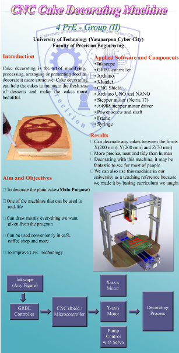
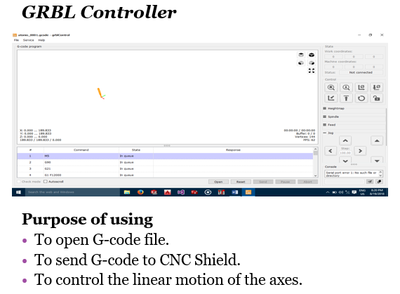
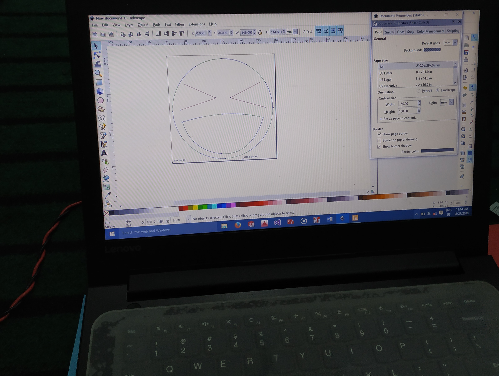
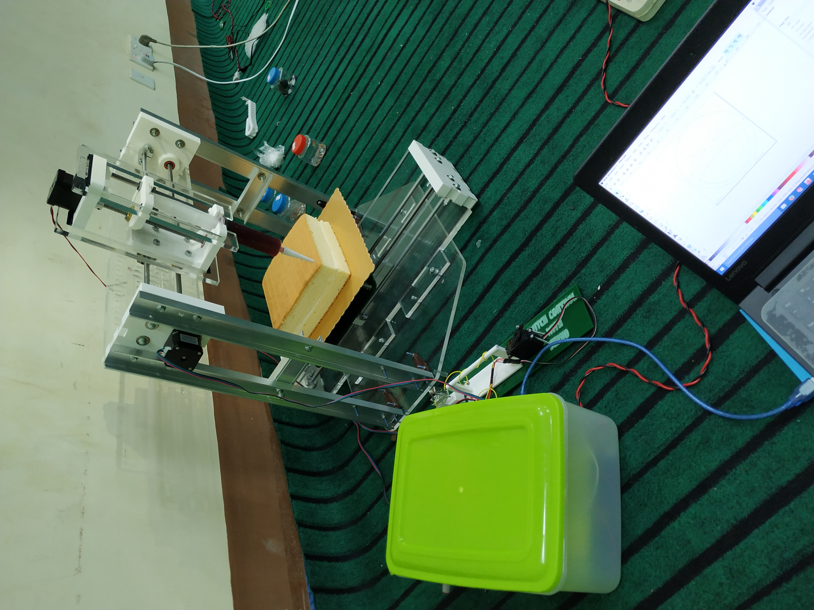
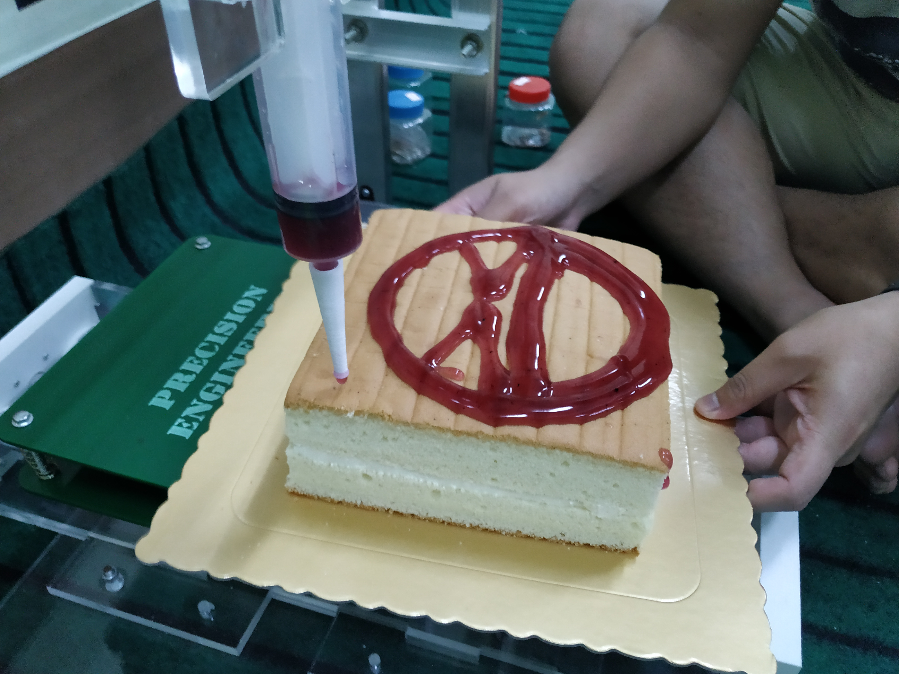
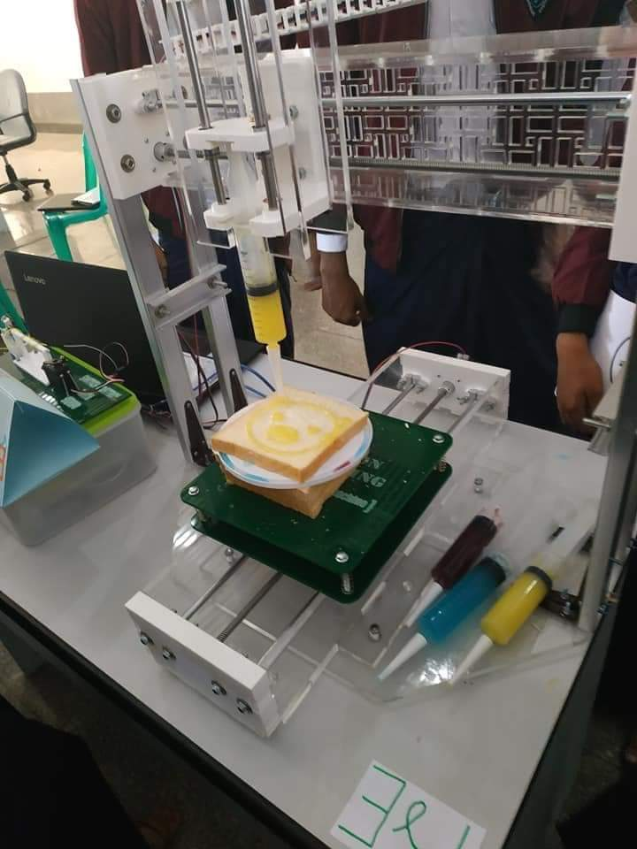

# CNC-Cake-Decorating-Machine

## About the project
This project is 4th year academic project and this is made by our project group including 10 members. We innovated CNC Cake Decorating Project and this project is awarded as `People Choice Award of Mechainical Precision & Automation Engineering` of Universty project show and `Best Project Award of Faculty of Precision Engineering` in 2018 academic year.
We divided "Design team" and "Control team" with 5 members for each team. I leaded the control team and our responsibility is to choose the best suitable open source CNC firmware for CNC cake decorating process and to implement it with the help of some onlite sites, CNC related subjects, control system and fluid system subjects that we learned. We choosed open source GRBL CNC firmware for drawing machine, and we made drawing machine at the first step as machine is to decorate/draw pattern, picture and letter on the cake. GRBL firmware (GRBL servo library) support X-axis, Y-axis and Servo up-down movement. X, Y axis is for Linear movement of the plate and servo is used as mechanical-switch for controlling gem/cream flow that is used to decorate on the cake. The most innovative part of this project is decorating gem/cream with fluid system and controlling it with Stepper Motor and using servo as mechanical-switch for motor control.

## Hardware, Software and Library we used:
* Hardware: Arduino Uno, CNC shield V3, Nema-17 stepper motors, A4988 stepper driver, SG90 Servo motor, 12V Power supply
* Software: Arduino IDE, Inkscape, GRBL Control 

## Operation Process/Control Procedure
First, sketch the picture in the Inkscape software and save as G code. Second, upload this G code file into the controller with GRBL software. Then, the machine draw the picture that we sketched in Inkscape software.

`Inkscape` -> `GRBL` -> `CNC-shield/Microcontroller` -> `Actuators - X&Y-axis Steppers, Hydraulic Stepper, Servo switch`

      

## Here is some pictures of the project.

# Thanks for enjoying this project!

!!! The resources/materials I provided in this repo is some of the resources in my laptop. The resources/materials in this repo is nott all the materials of this project, there are just some of the materials.
